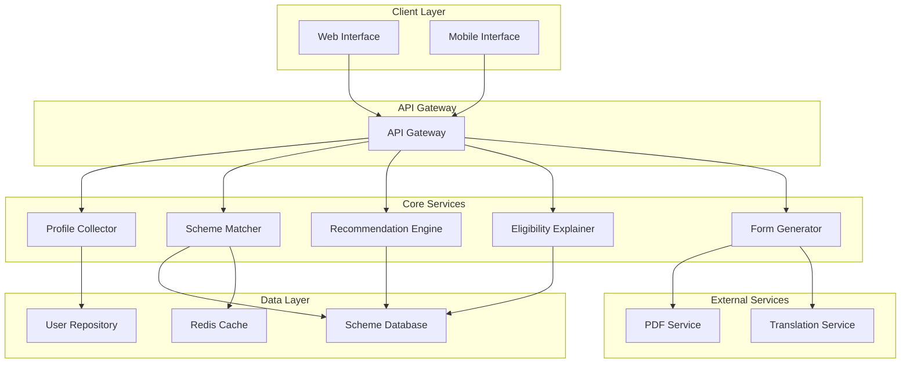

# Design Document: SchemeFinder AI

## Overview

SchemeFinder AI is a rural-first government scheme discovery platform that uses AI-powered matching to connect users with relevant welfare and livelihood schemes. The system prioritizes accessibility, low-bandwidth optimization, and data privacy while providing intelligent recommendations and automated form generation.

The platform follows a microservices architecture with clear separation between data collection, AI matching, recommendation ranking, and form generation components. The design emphasizes offline-first capabilities, progressive loading, and minimal data storage to serve rural users effectively.

## Architecture

### High-Level Architecture



### Service Architecture Patterns

**Microservices Design**: Each core component (Profile Collector, Scheme Matcher, Recommendation Engine, Eligibility Explainer, Form Generator) operates as an independent service with well-defined APIs.

**API Gateway Pattern**: Single entry point for all client requests, handling authentication, rate limiting, and request routing to appropriate services.

**Cache-Aside Pattern**: Redis cache stores frequently accessed scheme data and user sessions to reduce database load and improve response times.

**Circuit Breaker Pattern**: Prevents cascade failures when external services (PDF generation, translation) are unavailable.

## Components and Interfaces

### Profile Collector Service

**Responsibilities:**
- Collect and validate user demographic information
- Implement data minimization principles
- Provide form validation and error handling

**Key Interfaces:**
```typescript
interface UserProfile {
  age: number;
  annualIncome: number;
  state: string;
  district: string;
  occupation: OccupationCategory;
  socialCategory: SocialCategory;
  sessionId: string;
}

interface ProfileCollectorAPI {
  validateProfile(profile: UserProfile): ValidationResult;
  submitProfile(profile: UserProfile): Promise<ProfileSubmissionResult>;
  getFormMetadata(): Promise<FormMetadata>;
}
```

**Validation Rules:**
- Age: 1-120 years
- Annual Income: Positive number with currency validation
- Geographic: Valid state-district combinations from master data
- Categories: Predefined enums for occupation and social categories

### Scheme Matcher Service

**Responsibilities:**
- Apply eligibility rules to user profiles
- Evaluate against central and state schemes
- Return all matching schemes with confidence scores

**Core Algorithm:**
```typescript
interface EligibilityRule {
  ruleId: string;
  condition: RuleCondition;
  operator: ComparisonOperator;
  value: any;
  weight: number;
}

interface SchemeMatchResult {
  schemeId: string;
  matchScore: number;
  matchedRules: EligibilityRule[];
  confidence: ConfidenceLevel;
}

class SchemeMatcherEngine {
  evaluateEligibility(profile: UserProfile, scheme: Scheme): SchemeMatchResult;
  applyRuleSet(profile: UserProfile, rules: EligibilityRule[]): RuleEvaluationResult;
  calculateMatchScore(ruleResults: RuleEvaluationResult[]): number;
}
```

**Rule Engine Design:**
- **Condition Types**: Age ranges, income thresholds, geographic restrictions, occupation matches, category requirements
- **Operators**: Greater than, less than, equals, in range, contains, excludes
- **Weighted Scoring**: Each rule has a weight contributing to overall match confidence
- **Rule Composition**: Support for AND/OR logic between multiple conditions

### Recommendation Engine Service

**Responsibilities:**
- Rank matched schemes by relevance and benefit potential
- Apply business logic for prioritization
- Return top 3-5 recommendations

**Ranking Algorithm:**
```typescript
interface RankingFactors {
  benefitAmount: number;
  applicationComplexity: ComplexityLevel;
  profileAlignment: number;
  schemePopularity: number;
  applicationDeadline: Date;
}

interface RecommendationResult {
  rankedSchemes: RankedScheme[];
  totalMatches: number;
  recommendationReason: string;
}

class RecommendationEngine {
  rankSchemes(matches: SchemeMatchResult[], factors: RankingFactors[]): RecommendationResult;
  calculateRelevanceScore(match: SchemeMatchResult, factors: RankingFactors): number;
  applyBusinessRules(schemes: RankedScheme[]): RankedScheme[];
}
```

**Ranking Criteria:**
1. **Match Score** (40%): Confidence from eligibility matching
2. **Benefit Value** (25%): Financial assistance amount or benefit value
3. **Application Ease** (20%): Complexity of application process
4. **Urgency** (10%): Application deadlines and time sensitivity
5. **User Preference** (5%): Historical data on scheme uptake for similar profiles

### Eligibility Explainer Service

**Responsibilities:**
- Generate human-readable explanations for scheme eligibility
- Use simple language appropriate for rural users
- Highlight key qualifying factors

**Explanation Generation:**
```typescript
interface EligibilityExplanation {
  primaryReasons: string[];
  supportingFactors: string[];
  confidenceIndicator: string;
  languageCode: string;
}

class EligibilityExplainer {
  generateExplanation(profile: UserProfile, match: SchemeMatchResult): EligibilityExplanation;
  translateToLocalLanguage(explanation: EligibilityExplanation, targetLanguage: string): EligibilityExplanation;
  simplifyTechnicalTerms(text: string): string;
}
```

**Explanation Templates:**
- **Age-based**: "You qualify because you are [age] years old, which meets the [min-max] age requirement"
- **Income-based**: "Your annual income of ₹[amount] is below the maximum limit of ₹[threshold]"
- **Geographic**: "This scheme is available in [state/district] where you live"
- **Category-based**: "As a member of [category], you are eligible for this reserved scheme"

### Form Generator Service

**Responsibilities:**
- Generate PDF application forms with pre-filled data
- Support multiple government form formats
- Optimize for low-bandwidth download

**Form Generation Pipeline:**
```typescript
interface FormTemplate {
  templateId: string;
  schemeId: string;
  fields: FormField[];
  layout: FormLayout;
  version: string;
}

interface FormGenerationRequest {
  userProfile: UserProfile;
  schemeId: string;
  templateId: string;
  language: string;
}

class FormGenerator {
  generatePDF(request: FormGenerationRequest): Promise<PDFResult>;
  fillTemplate(template: FormTemplate, profile: UserProfile): FilledForm;
  optimizeForBandwidth(pdf: Buffer): Buffer;
  addWatermark(pdf: Buffer, metadata: FormMetadata): Buffer;
}
```

**PDF Optimization Techniques:**
- **Compression**: Use PDF/A format with optimized compression
- **Font Subsetting**: Include only required character sets
- **Image Optimization**: Compress embedded images without quality loss
- **Size Limits**: Target maximum 500KB per form for 2G compatibility

## Data Models

### Core Data Structures

```typescript
// User Profile Model
interface UserProfile {
  sessionId: string;
  age: number;
  annualIncome: number;
  state: string;
  district: string;
  occupation: OccupationCategory;
  socialCategory: SocialCategory;
  createdAt: Date;
  expiresAt: Date;
}

// Scheme Model
interface Scheme {
  schemeId: string;
  name: string;
  description: string;
  category: SchemeCategory;
  level: GovernmentLevel; // Central, State, District
  benefits: SchemeBenefit[];
  eligibilityRules: EligibilityRule[];
  requiredDocuments: Document[];
  applicationProcess: ApplicationStep[];
  isActive: boolean;
  applicationDeadline?: Date;
  lastUpdated: Date;
}

// Eligibility Rule Model
interface EligibilityRule {
  ruleId: string;
  field: ProfileField;
  operator: ComparisonOperator;
  value: any;
  weight: number;
  description: string;
}

// Scheme Benefit Model
interface SchemeBenefit {
  benefitType: BenefitType;
  amount?: number;
  description: string;
  duration?: string;
  frequency?: PaymentFrequency;
}

// Document Model
interface Document {
  documentId: string;
  name: string;
  description: string;
  isRequired: boolean;
  alternativeDocuments?: string[];
}
```

### Enumerations

```typescript
enum OccupationCategory {
  FARMER = "farmer",
  AGRICULTURAL_LABORER = "agricultural_laborer",
  SMALL_BUSINESS = "small_business",
  ARTISAN = "artisan",
  DAILY_WAGE_WORKER = "daily_wage_worker",
  UNEMPLOYED = "unemployed",
  STUDENT = "student",
  OTHER = "other"
}

enum SocialCategory {
  GENERAL = "general",
  OBC = "obc",
  SC = "sc",
  ST = "st",
  EWS = "ews"
}

enum SchemeCategory {
  AGRICULTURE = "agriculture",
  EMPLOYMENT = "employment",
  HOUSING = "housing",
  EDUCATION = "education",
  HEALTHCARE = "healthcare",
  FINANCIAL_INCLUSION = "financial_inclusion",
  WOMEN_EMPOWERMENT = "women_empowerment",
  SKILL_DEVELOPMENT = "skill_development"
}

enum BenefitType {
  CASH_TRANSFER = "cash_transfer",
  SUBSIDY = "subsidy",
  LOAN = "loan",
  INSURANCE = "insurance",
  TRAINING = "training",
  EQUIPMENT = "equipment",
  SERVICE_ACCESS = "service_access"
}
```

### Database Schema Design

**User Sessions Table** (Temporary storage):
```sql
CREATE TABLE user_sessions (
  session_id VARCHAR(36) PRIMARY KEY,
  profile_data JSONB NOT NULL,
  created_at TIMESTAMP DEFAULT NOW(),
  expires_at TIMESTAMP NOT NULL,
  INDEX idx_expires_at (expires_at)
);
```

**Schemes Table**:
```sql
CREATE TABLE schemes (
  scheme_id VARCHAR(50) PRIMARY KEY,
  name VARCHAR(200) NOT NULL,
  description TEXT,
  category VARCHAR(50) NOT NULL,
  government_level VARCHAR(20) NOT NULL,
  is_active BOOLEAN DEFAULT TRUE,
  application_deadline DATE,
  created_at TIMESTAMP DEFAULT NOW(),
  updated_at TIMESTAMP DEFAULT NOW(),
  INDEX idx_category (category),
  INDEX idx_active_deadline (is_active, application_deadline)
);
```

**Eligibility Rules Table**:
```sql
CREATE TABLE eligibility_rules (
  rule_id VARCHAR(36) PRIMARY KEY,
  scheme_id VARCHAR(50) NOT NULL,
  field_name VARCHAR(50) NOT NULL,
  operator VARCHAR(20) NOT NULL,
  rule_value TEXT NOT NULL,
  weight DECIMAL(3,2) DEFAULT 1.0,
  description TEXT,
  FOREIGN KEY (scheme_id) REFERENCES schemes(scheme_id),
  INDEX idx_scheme_id (scheme_id)
);
```

## Low-Bandwidth Optimization Strategy

### Progressive Loading Architecture

**Critical Path Loading**:
1. **First Load** (< 50KB): Basic form and essential CSS
2. **Second Load** (< 100KB): Scheme matching logic and core JavaScript
3. **Third Load** (< 200KB): Enhanced UI features and form generation
4. **Background Load**: Additional schemes and optimization features

**Caching Strategy**:
```typescript
interface CacheStrategy {
  staticAssets: {
    duration: "1 year";
    compression: "gzip + brotli";
  };
  schemeData: {
    duration: "24 hours";
    strategy: "stale-while-revalidate";
  };
  userSessions: {
    duration: "30 minutes";
    storage: "memory + redis";
  };
}
```

### Data Compression Techniques

**API Response Optimization**:
- **JSON Minification**: Remove whitespace and use short property names
- **Response Compression**: Gzip compression for all API responses
- **Pagination**: Limit scheme results to essential information initially
- **Field Selection**: Allow clients to specify required fields only

**Image and Asset Optimization**:
- **WebP Format**: Use WebP images with JPEG fallbacks
- **Lazy Loading**: Load images only when needed
- **Sprite Sheets**: Combine small icons into single requests
- **CDN Distribution**: Serve static assets from geographically distributed CDNs

### Offline-First Capabilities

**Service Worker Implementation**:
```typescript
class SchemeFinderServiceWorker {
  cacheEssentialAssets(): Promise<void>;
  cacheUserProfile(profile: UserProfile): Promise<void>;
  handleOfflineRequests(request: Request): Promise<Response>;
  syncWhenOnline(): Promise<void>;
}
```

**Offline Features**:
- **Profile Storage**: Cache user profile locally for offline access
- **Scheme Information**: Store basic scheme details for offline viewing
- **Form Drafts**: Save partially completed forms locally
- **Sync Queue**: Queue form submissions for when connectivity returns

## Error Handling

### Error Classification and Response Strategy

**Client-Side Error Handling**:
```typescript
enum ErrorType {
  VALIDATION_ERROR = "validation_error",
  NETWORK_ERROR = "network_error",
  SERVER_ERROR = "server_error",
  TIMEOUT_ERROR = "timeout_error",
  OFFLINE_ERROR = "offline_error"
}

interface ErrorResponse {
  errorType: ErrorType;
  message: string;
  userMessage: string;
  retryable: boolean;
  suggestedAction: string;
}

class ErrorHandler {
  handleValidationError(error: ValidationError): ErrorResponse;
  handleNetworkError(error: NetworkError): ErrorResponse;
  handleServerError(error: ServerError): ErrorResponse;
  showUserFriendlyMessage(error: ErrorResponse): void;
}
```

**Graceful Degradation Patterns**:
- **Partial Results**: Show available schemes even if some services fail
- **Cached Fallbacks**: Use cached data when real-time data unavailable
- **Simplified UI**: Reduce functionality gracefully under poor conditions
- **Retry Mechanisms**: Automatic retry with exponential backoff

**Error Recovery Strategies**:
- **Form State Preservation**: Save form data locally to prevent loss
- **Progressive Enhancement**: Core functionality works without JavaScript
- **Alternative Paths**: Provide multiple ways to complete key tasks
- **Clear Communication**: Explain errors in simple, actionable language

### Monitoring and Logging

**Performance Metrics**:
- Page load times across different connection speeds
- API response times for each service
- Cache hit rates and effectiveness
- User completion rates for key flows

**Error Tracking**:
- Client-side error rates and types
- Server-side error patterns and frequency
- Network failure patterns by geographic region
- User abandonment points in the application flow

## Testing Strategy

The testing approach combines comprehensive unit testing for specific functionality with property-based testing to verify universal correctness properties across all possible inputs.

### Unit Testing Focus Areas

**Component-Specific Tests**:
- Profile validation with edge cases (boundary ages, invalid income values)
- Scheme matching with specific rule combinations
- Form generation with various template formats
- Error handling scenarios and recovery mechanisms

**Integration Testing**:
- End-to-end user flows from profile submission to form generation
- API gateway routing and service communication
- Database operations and data consistency
- External service integration (PDF generation, translation services)

### Property-Based Testing Configuration

**Testing Framework**: Use Hypothesis (Python) or fast-check (TypeScript) for property-based testing with minimum 100 iterations per property test.

**Test Tagging Format**: Each property test must include a comment referencing the design document property:
```typescript
// Feature: schemefinder-ai, Property 1: Profile validation consistency
```

**Property Test Categories**:
- **Data Validation Properties**: Verify that all valid inputs are accepted and invalid inputs rejected
- **Matching Algorithm Properties**: Ensure consistent scheme matching across different input combinations
- **Ranking Properties**: Verify that scheme rankings follow defined business rules
- **Form Generation Properties**: Ensure generated forms maintain data integrity and format consistency

## Correctness Properties

*A property is a characteristic or behavior that should hold true across all valid executions of a system—essentially, a formal statement about what the system should do. Properties serve as the bridge between human-readable specifications and machine-verifiable correctness guarantees.*

### Property 1: Profile Validation Consistency
*For any* user profile input, the Profile_Collector should accept the profile if and only if all validation rules are satisfied (age 1-120, positive income, valid geographic selections), and should provide specific error messages for each validation failure.
**Validates: Requirements 1.3, 1.4, 1.5**

### Property 2: Comprehensive Scheme Matching
*For any* complete user profile, the Scheme_Matcher should evaluate the profile against all active schemes in the database and return all schemes where the user meets the minimum eligibility criteria, considering both central and state-level schemes.
**Validates: Requirements 2.1, 2.2, 2.3, 2.4**

### Property 3: Recommendation Ranking Consistency
*For any* set of matched schemes, the Recommendation_Engine should rank them consistently based on benefit amount, application ease, and profile alignment, always returning the top 3-5 schemes when sufficient matches exist.
**Validates: Requirements 3.1, 3.2, 3.3**

### Property 4: Active Scheme Filtering
*For any* recommendation result, all returned schemes should have active status and be currently accepting applications.
**Validates: Requirements 3.5**

### Property 5: Eligibility Explanation Completeness
*For any* recommended scheme, the Eligibility_Explainer should generate an explanation that references the specific user profile attributes that match the scheme criteria and includes a confidence level indicator.
**Validates: Requirements 4.1, 4.2, 4.4, 4.5**

### Property 6: Scheme Information Display Completeness
*For any* scheme in the database, when displayed to users, all required information fields (benefits, documents, application steps) should be present and properly formatted.
**Validates: Requirements 5.3, 5.5**

### Property 7: Form Generation Data Integrity
*For any* user profile and scheme combination, the Form_Generator should create a valid PDF that contains all available profile information in the correct fields, clearly marks unfilled mandatory fields, and maintains data integrity throughout the generation process.
**Validates: Requirements 6.1, 6.2, 6.3, 6.5, 6.6**

### Property 8: PDF Size Optimization
*For any* generated PDF form, the file size should be optimized for low-bandwidth environments and remain within acceptable limits for 2G network downloads.
**Validates: Requirements 7.5**

### Property 9: Data Minimization and Privacy
*For any* user interaction, the system should collect, store, and process only the minimum data necessary for scheme matching, encrypt all personal information, and automatically purge temporary data according to retention policies.
**Validates: Requirements 8.1, 8.2, 8.4, 8.5, 8.7**

### Property 10: Database Content Completeness
*For any* scheme in the database, all required information fields (eligibility criteria, benefits, required documents, application procedures) should be complete and valid before the scheme can be activated.
**Validates: Requirements 9.2, 9.5, 9.6**

### Property 11: Audit Trail Maintenance
*For any* change to scheme information, the system should maintain a complete version history that tracks what changed, when, and preserve the ability to audit all modifications.
**Validates: Requirements 9.4**

### Property 12: Error Handling Consistency
*For any* system error that occurs, the system should log the error appropriately and provide clear, actionable error messages to users while maintaining system stability.
**Validates: Requirements 10.6, 11.5**

### Property 13: Cross-Platform Functionality
*For any* supported platform (desktop, tablet, mobile) and browser (Chrome, Firefox, Safari, Edge), all core functionality should work correctly with responsive design that adapts to different screen sizes while maintaining consistent user experience.
**Validates: Requirements 12.1, 12.2, 12.3, 12.4, 12.6**

### Property 14: PDF Compatibility
*For any* generated PDF form, the file should be compatible with standard PDF viewers and maintain proper formatting for both digital viewing and printing.
**Validates: Requirements 12.5**

### Property 15: Content Compression and Optimization
*For any* API response or content delivery, the system should apply appropriate compression and optimization techniques to minimize data usage while maintaining content quality.
**Validates: Requirements 7.2**

### Property 16: Offline Content Accessibility
*For any* previously loaded content, when network connectivity is poor or unavailable, users should be able to access cached information and continue using offline-capable features.
**Validates: Requirements 7.3**

### Property 17: Progressive Loading Priority
*For any* page load, essential information and functionality should be loaded and displayed before non-essential content, following a clear priority order.
**Validates: Requirements 7.4**

### Property 18: Multi-Language Content Support
*For any* supported language, the system should be able to display content appropriately while maintaining functionality and user experience quality.
**Validates: Requirements 10.4**

## Error Handling

### Error Classification and Response Strategy

**Client-Side Error Handling**:
```typescript
enum ErrorType {
  VALIDATION_ERROR = "validation_error",
  NETWORK_ERROR = "network_error",
  SERVER_ERROR = "server_error",
  TIMEOUT_ERROR = "timeout_error",
  OFFLINE_ERROR = "offline_error"
}

interface ErrorResponse {
  errorType: ErrorType;
  message: string;
  userMessage: string;
  retryable: boolean;
  suggestedAction: string;
}

class ErrorHandler {
  handleValidationError(error: ValidationError): ErrorResponse;
  handleNetworkError(error: NetworkError): ErrorResponse;
  handleServerError(error: ServerError): ErrorResponse;
  showUserFriendlyMessage(error: ErrorResponse): void;
}
```

**Graceful Degradation Patterns**:
- **Partial Results**: Show available schemes even if some services fail
- **Cached Fallbacks**: Use cached data when real-time data unavailable
- **Simplified UI**: Reduce functionality gracefully under poor conditions
- **Retry Mechanisms**: Automatic retry with exponential backoff

**Error Recovery Strategies**:
- **Form State Preservation**: Save form data locally to prevent loss
- **Progressive Enhancement**: Core functionality works without JavaScript
- **Alternative Paths**: Provide multiple ways to complete key tasks
- **Clear Communication**: Explain errors in simple, actionable language

### Monitoring and Logging

**Performance Metrics**:
- Page load times across different connection speeds
- API response times for each service
- Cache hit rates and effectiveness
- User completion rates for key flows

**Error Tracking**:
- Client-side error rates and types
- Server-side error patterns and frequency
- Network failure patterns by geographic region
- User abandonment points in the application flow

## Testing Strategy

The testing approach combines comprehensive unit testing for specific functionality with property-based testing to verify universal correctness properties across all possible inputs.

### Unit Testing Focus Areas

**Component-Specific Tests**:
- Profile validation with edge cases (boundary ages, invalid income values)
- Scheme matching with specific rule combinations
- Form generation with various template formats
- Error handling scenarios and recovery mechanisms

**Integration Testing**:
- End-to-end user flows from profile submission to form generation
- API gateway routing and service communication
- Database operations and data consistency
- External service integration (PDF generation, translation services)

### Property-Based Testing Configuration

**Testing Framework**: Use Hypothesis (Python) or fast-check (TypeScript) for property-based testing with minimum 100 iterations per property test.

**Test Tagging Format**: Each property test must include a comment referencing the design document property:
```typescript
// Feature: schemefinder-ai, Property 1: Profile validation consistency
```

**Property Test Categories**:
- **Data Validation Properties**: Verify that all valid inputs are accepted and invalid inputs rejected
- **Matching Algorithm Properties**: Ensure consistent scheme matching across different input combinations
- **Ranking Properties**: Verify that scheme rankings follow defined business rules
- **Form Generation Properties**: Ensure generated forms maintain data integrity and format consistency

**Dual Testing Approach**:
- **Unit tests**: Focus on specific examples, edge cases, and error conditions
- **Property tests**: Verify universal properties across all inputs through randomization
- Both approaches are complementary and necessary for comprehensive coverage

**Testing Balance**:
- Unit tests should focus on integration points, specific examples, and edge cases
- Property tests should handle comprehensive input coverage through randomization
- Avoid writing excessive unit tests when property tests can cover the same scenarios more thoroughly